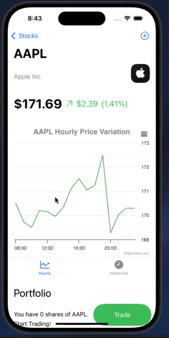

# [Trading App](https://drive.google.com/file/d/1Ol1roW9YVrpIwGaZK-QpPgqVzTm6dhIb/view?usp=sharing)

Demo Video: https://drive.google.com/file/d/1Ol1roW9YVrpIwGaZK-QpPgqVzTm6dhIb/view?usp=sharing

* An app for searching and trading stocks in a sandboxed environment.
* Users can trade based on market hours, favorite stocks, and view detailed graphs using Highcharts.
* Features include live market updates, sandboxed trading, historical charts (up to 2 years), historical EPS charts, and a news tab for each stock. 
* Tech stack: SwiftUI, NodeJS, MongoDB, ExpressJS

  
  <figure style="flex: 0 0 49%;">
    
    <figcaption>Home Page</figcaption>
  </figure>
  <figure style="flex: 0 0 49%;">
    
    <figcaption>Stock Page</figcaption>
  </figure>

<figure style="text-align: center;">
  
  <figcaption>News Section</figcaption>
</figure>