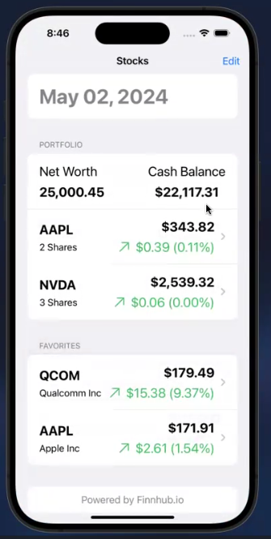
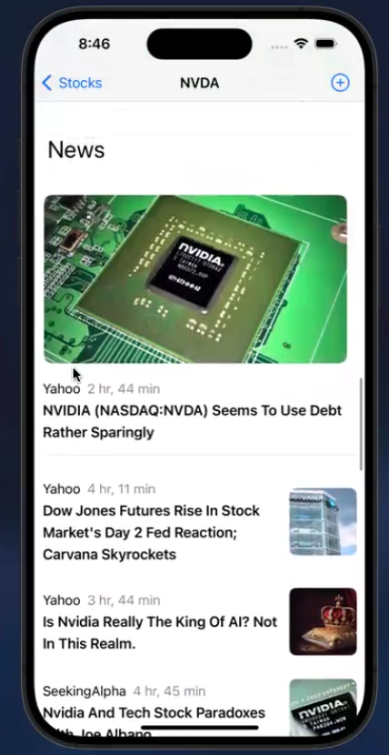

# [Trading App](https://drive.google.com/file/d/1Ol1roW9YVrpIwGaZK-QpPgqVzTm6dhIb/view?usp=sharing)

|  Home Page|  |   News Section|
|:-:|:-:|:-:|

Demo Video: https://drive.google.com/file/d/1Ol1roW9YVrpIwGaZK-QpPgqVzTm6dhIb/view?usp=sharing

* An app for searching and trading stocks in a sandboxed environment.
* Users can trade based on market hours, favorite stocks, and view detailed graphs using Highcharts.
* Features include
    - Live market updates
    - Stock Search Autocomplete
    - Sandboxed trading
    - Historical charts (up to 2 years)
    - Historical EPS charts
    - News tab for each stock
* Tech stack: SwiftUI, NodeJS, MongoDB, ExpressJS

